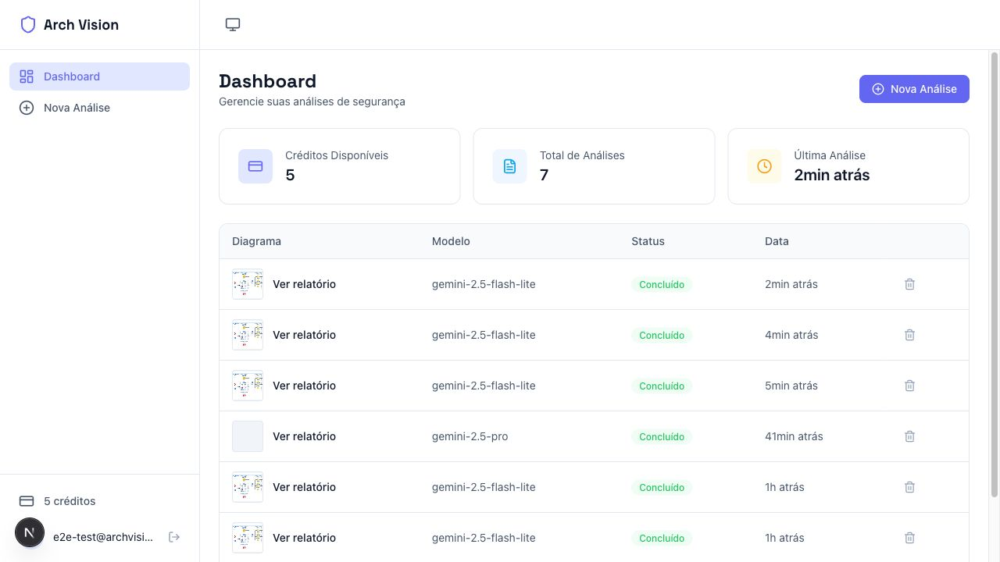
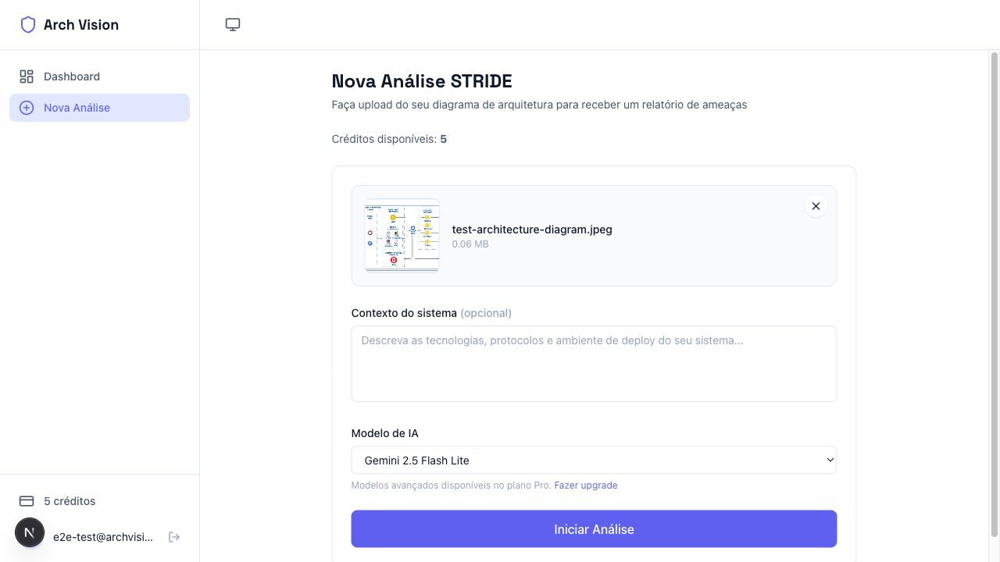
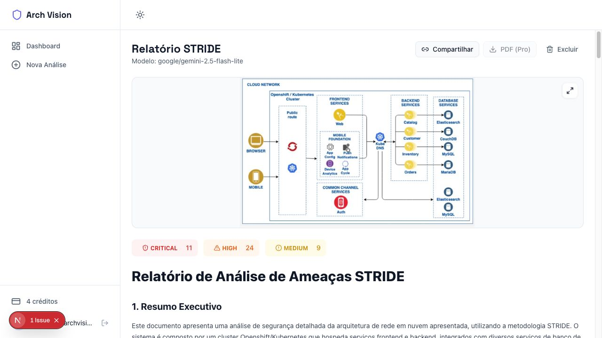
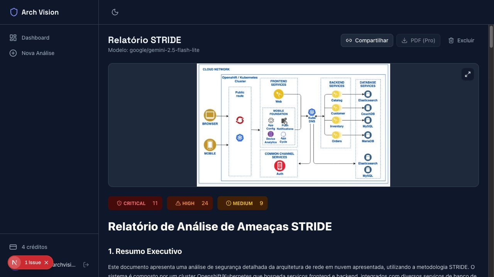
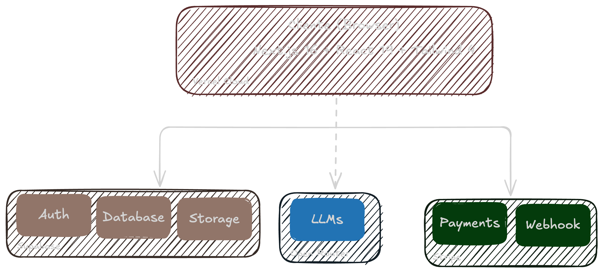

<div align="center">

# Arch Vision

[](https://nextjs.org/)
[](https://react.dev/)
[](https://www.typescriptlang.org/)
[](https://supabase.com/)
[](https://stripe.com/)
[](https://tailwindcss.com/)
[](https://playwright.dev/)

</div>

## Autores e Propósito
**Projeto Acadêmico**: FIAP Tech Challenge - Hackathon - Fase 5  
**Curso**: Pós-graduação em Inteligência Artificial para Desenvolvedores  
**Grupo 46**

### Integrantes do Grupo
- **Robson Calixto** - robsoncaliixto@gmail.com
- **Araguacy Pereira** - araguacybp@yahoo.com.br
- **Vinícius Costa** - mcostavini98@gmail.com

## Descrição

SaaS de Modelagem de Ameaças com IA: Automatize a análise STRIDE de diagramas de arquitetura usando LLMs. MVP completo com Dashboard, Upload de Imagens e Relatórios de Vulnerabilidade detalhados. Desenvolvido para o Hackathon FIAP.

## O Problema

O desenho de arquitetura não passa por uma análise de ameaças quando construído. Geralmente, só é identificado na implementação ou na fase de testes. A maioria das equipes sabe disso, mas o threat modeling manual exige conhecimento especializado em seguranca, consome horas de trabalho e quase sempre fica para "a próxima sprint". O resultado? Sistemas vão para produção sem nenhuma análise formal de ameaças.

## Como o Arch Vision resolve isso

O Arch Vision usa modelos de IA com visão computacional para analisar diagramas de arquitetura e gerar relatórios de segurança baseados na metodologia **STRIDE** (Spoofing, Tampering, Repudiation, Information Disclosure, Denial of Service, Elevation of Privilege).

O que antes levava dias com um consultor de seguranca agora leva menos de 5 minuto com uma IA especializada para esse trabalho. 


## Como Funciona


## Demonstração

<div align="center">

| Landing Page | Dashboard |
|:---:|:---:|
|  |  |

| Upload do Diagrama | Relatorio STRIDE |
|:---:|:---:|
|  |  |

| Link Compartilhavel | Dark Mode |
|:---:|:---:|
|  |  |

</div>

## O que o Arch Vision entrega

### Relatorios de seguranca acionaveis
Cada relatorio identifica vulnerabilidades reais, classifica por severidade (Critical, High, Medium, Low) e recomenda mitigações específicas. Não é um checklist genérico. A análise é feita sobre **o seu diagrama**.

### Escolha entre 6 modelos de IA
| Plano | Modelos disponíveis |
|-------|-------------------|
| **Starter (gratis)** | Gemini 2.5 Flash Lite, GPT-4o Mini, DeepSeek V3.2 |
| **Pro (R$49/mes)** | Claude Sonnet 4/4.5, Gemini 2.5 Pro |

### Autenticacao sem atrito
- **Magic Link** — receba um link no email, clique e entre. Sem senha.
- **GitHub OAuth** — autentique com um clique usando sua conta GitHub.

### Compartilhe e exporte
- Gere **links publicos** para enviar relatorios a colegas ou gestores
- Exporte para **PDF** com formatacao profissional (recurso Pro)
- Tudo renderizado em Markdown com syntax highlighting

### Sistema de creditos transparente
- **Starter:** 1 analise gratuita por mes para experimentar
- **Pro:** 5 analises por mes com acesso aos modelos mais avançados
- Se a analise falhar, o credito volta automaticamente

### Dark mode e responsividade
Interface adaptada para desktop e mobile, com tema claro/escuro persistente entre sessões. Acessibilidade inclusa (ARIA landmarks, hierarquia semantica de headings).

## Como Usar o MVP 

1. Acesse o site: https://archvision.work
2. Clique em "Entrar"
3. Faça login com sua conta GitHub ou Magic Link
4. Assine o plano pro usando um [cartão fake da stripe](https://docs.stripe.com/testing?locale=pt-BR)
5. Faça upload do diagrama de arquitetura
6. Selecione o modelo de IA
7. Aguarde a analise
8. Veja o relatorio


## Arquitetura



**Fluxo de dados:**

1. Upload do diagrama → armazenado no **Supabase Storage**
2. Report criado com status `pending` no banco
3. Imagem enviada para o modelo de IA via **OpenRouter**
4. IA retorna analise STRIDE em Markdown estruturado
5. Parser extrai severidades e atualiza o report como `completed`
6. Frontend faz polling e renderiza o resultado em tempo real

---

## Tech Stack

| Camada | Tecnologia | Por que essa escolha |
|--------|-----------|---------------------|
| **Frontend** | Next.js 16, React 19, TypeScript 5 | App Router com Server Components e Server Actions |
| **Estilizacao** | Tailwind CSS 4, Lucide React | Sistema de cores semantico com suporte a temas |
| **Banco de Dados** | Supabase (PostgreSQL) | Auth, DB e Storage integrados em uma plataforma |
| **IA** | OpenRouter API | Acesso a multiplos modelos com uma unica API |
| **Pagamentos** | Stripe | Assinaturas recorrentes com webhooks confiaveis |
| **PDF** | html2canvas-pro + jsPDF | Exportacao client-side sem dependência de servidor |
| **Testes** | Playwright | E2E com 1300+ linhas e 20 cenários automatizados |

---

## Como Executar

### Pre-requisitos

- Node.js 18+
- Conta no [Supabase](https://supabase.com)
- Chave de API do [OpenRouter](https://openrouter.ai)
- Conta no [Stripe](https://stripe.com)

### Instalacao

```bash
git clone <repo-url>
cd arch-vision-app
npm install
cp .env.local.example .env.local
```

### Variaveis de Ambiente

Preencha o `.env.local`:

```env
# Supabase
NEXT_PUBLIC_SUPABASE_URL=https://your-project.supabase.co
NEXT_PUBLIC_SUPABASE_PUBLISHABLE_KEY=sb_publishable_...
SUPABASE_SERVICE_ROLE_KEY=eyJ...

# OpenRouter
OPENROUTER_API_KEY=sk-or-...
NEXT_PUBLIC_APP_URL=http://localhost:3000

# Stripe
STRIPE_SECRET_KEY=sk_test_...
STRIPE_WEBHOOK_SECRET=whsec_...
STRIPE_PRO_PRICE_ID=price_...
```

### Executando localmente

```bash
npm run dev              # Servidor de desenvolvimento
npm run build && npm start  # Build e servidor de producao
npm run lint             # Verificacao de codigo
npm run test:e2e         # Testes end-to-end
```

Acesse `http://localhost:3000`.


## Banco de Dados


### users
- id (uuid, PK, FK → auth.users)
- credits (integer, default: 1)
- tier ('starter' | 'pro')
- stripe_customer_id (text)
- stripe_subscription_id (text)
- subscription_ends_at (timestamptz)

### reports
- id (uuid, PK)
- user_id (uuid, FK → users)
- image_url (text)
- ai_model (text)
- context_text (text, opcional)
- status ('pending' | 'processing' | 'completed' | 'failed')
- result_markdown (text)
- severity_summary (jsonb: {critical, high, medium, low})
- error_message (text)
- created_at (timestamptz)
- completed_at (timestamptz)


## Testes

**Testes E2E** com Playwright. 20 cenarios, 51 assertions — todos passando.

| Categoria | O que cobre |
|-----------|------------|
| Fluxo autenticado | Upload > analise > relatorio > compartilhamento > PDF |
| Paginas publicas | Landing, about, login (estrutura e conteudo) |
| Acessibilidade | ARIA landmarks, hierarquia de headings |
| Responsividade | Layout mobile 375x812 |
| Temas | Alternancia e persistencia dark/light mode |
| Seguranca | Redirect de rotas protegidas para login |
| SEO | Meta tags e titulo das paginas |

---

## Licença

Este projeto está licenciado sob os termos especificados no arquivo LICENSE.